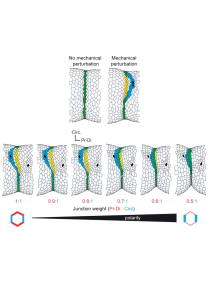

# Polarity




This is a leg fold formation simulation package for the article:

### Mechanical control of morphogenesis robustness in an inherently challenging environment

Emmanuel Martin^1, Sophie Theis^(1,2), Guillaume Gay^(2,3), Bruno Monier^1, Christian Rouviere^4 and Magali Suzanne^1.
1-Molecular, Cellular & Developmental Biology (MCD), Center of Integrative Biology (CBI), Toulouse University, CNRS, UPS, Toulouse, France.
2-Morphogénie Logiciels, 32110 St Martin d'Armagnac, France.
3-Turing Center For Living Systems, Aix-MarseilleUniversity, 13009, Marseille, France.
4-Image Processing Facility, Center of Integrative Biology (CBI), Université de Toulouse, CNRS, UPS, France.

[Article](https://www.cell.com/developmental-cell/fulltext/S1534-5807(21)00036-8?_returnURL=https%3A%2F%2Flinkinghub.elsevier.com%2Fretrieve%2Fpii%2FS1534580721000368%3Fshowall%3Dtrue)


## Try it with my binder by clicking the badge bellow:

[](https://mybinder.org/v2/gh/suzannelab/polarity/HEAD) 


## Dependencies

- python > 3.6
- tyssue >= 0.7.0


## Installation

This package is based on the [`tyssue`](https://tyssue.readthedocs.org) library and its dependencies.

The recommanded installation route is to use the `conda` package manager. You can get a `conda` distribution for your OS at https://www.anaconda.com/download . Make sure to choose a python 3.6 version. Once you have installed conda, you can install tyssue with:

```bash
$ conda install -c conda-forge tyssue
```

You can then download and install polarity from github:

- with git:

```bash
$ git clone https://github.com/suzannelab/polarity.git
$ cd polarity
$ python setup.py install
```

- or by downloading https://github.com/suzannelab/polarity/archive/master.zip ,  uncompressing the archive and running `python setup.py install` in the root directory.

## Licence

This work is free software, published under the MPLv2 licence, see LICENCE for details.


&copy; The article authors -- all rights reserved